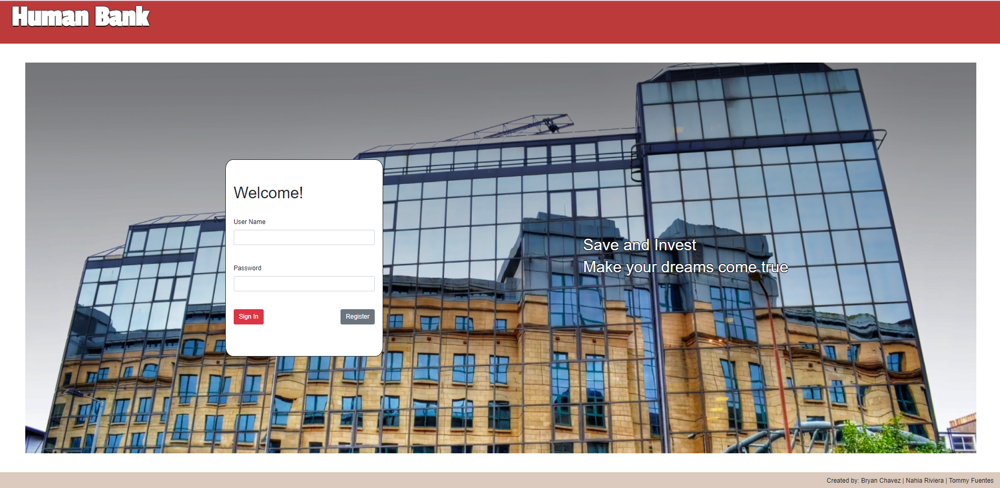
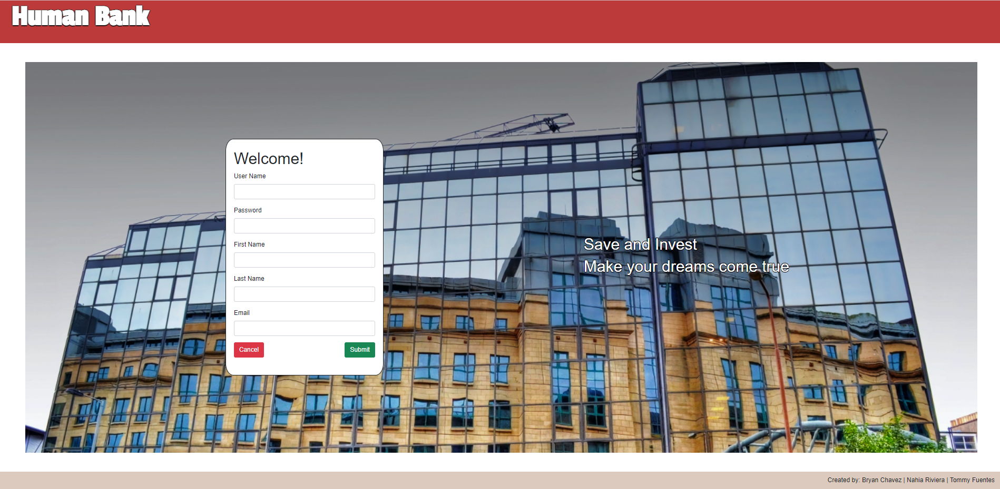
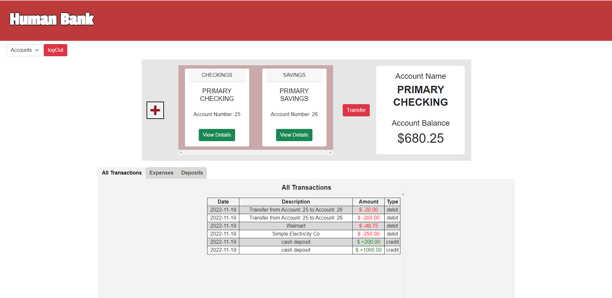
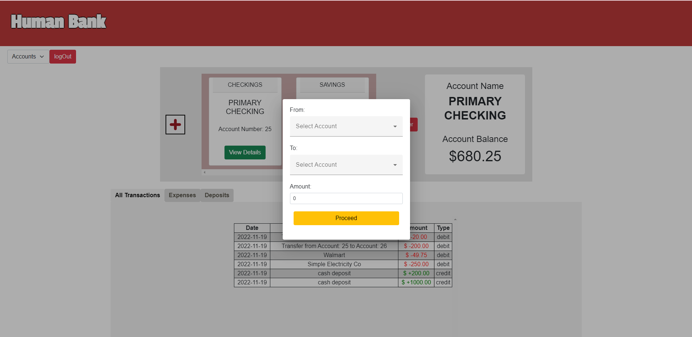
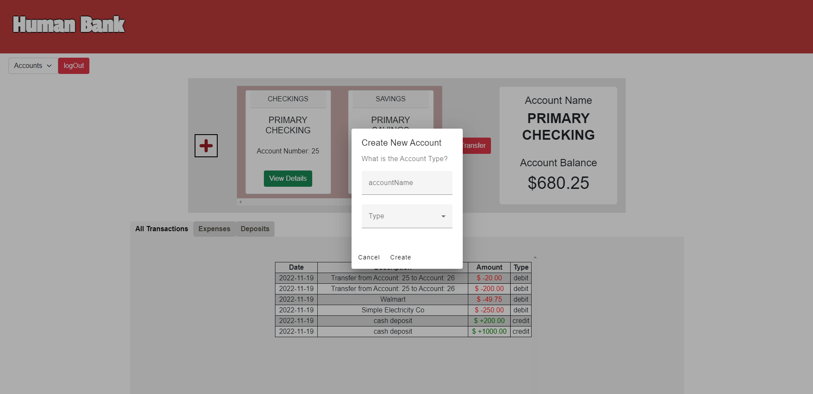
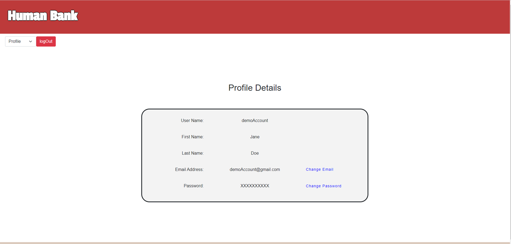

# BankingFrontEnd

The goal of this project was to create a front-end using Angular for an imaginary banking institution named "Human Bank". The application was constructed using Angular, Angular Material, and Bootstrap 5. The back-end for this project can be found [here](https://github.com/Chavez102/BankingSystem_BackEnd).

## Getting Started

1. Branch and Clone the repository.
2. Run `npm install` to install dependencies.
3. Run `npm start` to start the application in the development environment.
4. If a new window did not open in your browser, navigate to `http://localhost:4200/`.

The application will automatically reload if you change any of the source files.

## Screenshots

---

#### Login

## 

#### Register

## 

#### Account Summary

## 

#### Transfer Money

## 

#### Create Account

## 

#### Profile Page

